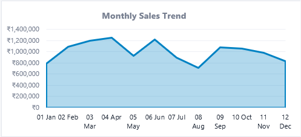
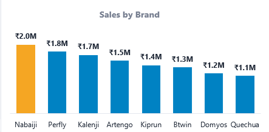
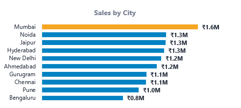
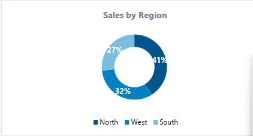
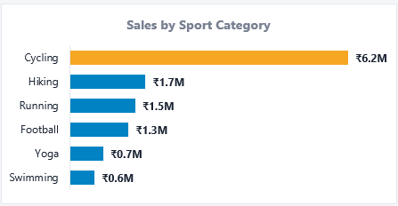
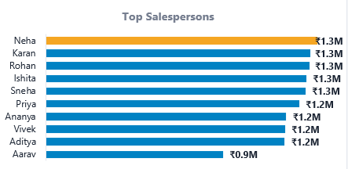

# 🏪 Decathlon Retail Sales Performance Dashboard

> An interactive Business Intelligence dashboard built entirely in **Microsoft Excel** to analyze retail sales performance for a Decathlon-style sporting goods retail chain.

---

# 📌 Project Overview

Retail organizations generate thousands of sales transactions every day. Converting this raw transactional data into meaningful business insights is essential for making informed decisions.

This project demonstrates how Microsoft Excel can be used as a Business Intelligence tool to transform raw sales data into an interactive dashboard that enables management to monitor sales, profitability, customer behaviour, regional performance, and product performance.

The dashboard has been designed for business users who require quick access to important KPIs without manually analyzing thousands of records.

---

# 🎯 Business Problem

Retail managers often face questions such as:

- Which product categories generate the highest revenue?
- Which stores are performing the best?
- Which cities contribute the most sales?
- How do monthly sales fluctuate?
- Which brands perform better than others?
- What payment methods are customers using?
- Which sales representatives are top performers?

Instead of manually answering these questions, this dashboard provides an interactive solution.

---

# 🏗 Project Architecture

```text
                    Raw Dataset
                         │
                         ▼
                  Data Cleaning
                         │
                         ▼
               Data Preparation
                         │
                         ▼
                Excel Formulas
      (IF, SUMIFS, COUNTIFS, XLOOKUP)
                         │
                         ▼
                  Pivot Tables
                         │
                         ▼
                  Pivot Charts
                         │
                         ▼
             Interactive Dashboard
                         │
                         ▼
          Business Insights & Reports
```

---

# 📂 Project Folder Structure

```text
Decathlon-Retail-Sales-Dashboard
│
├── Dashboard.xlsx
├── README.md
│
├── screenshots
│   ├── Dashboard.png
│   ├── monthlysales.png
│   ├── salesbybrand.png
│   ├── salesbycity.png
│   ├── salesbyregion.png
│   ├── salesbysportscategory.png
│   └── topsalesperson.png
│
└── Dataset.xlsx
```

---

# 📊 Dashboard Preview

## Executive Dashboard


---

# 📸 Dashboard Components

## Monthly Sales Trend



---

## Sales by Brand



---

## Sales by City



---

## Sales by Region



---

## Sales by Sports Category



---

## Top Salesperson



---

# 📋 Dataset Explanation

The dataset consists of simulated retail transactions from multiple Decathlon stores across different cities.

Each record represents a single customer purchase.

### Dataset Fields

| Column | Description |
|---------|-------------|
| Order ID | Unique transaction identifier |
| Order Date | Date of purchase |
| Store | Store where purchase was made |
| City | Store location |
| Region | Sales region |
| Customer ID | Unique customer |
| Gender | Customer gender |
| Age Group | Customer age category |
| Membership Type | Customer loyalty program |
| Sport Category | Product category |
| Product | Product purchased |
| Brand | Product brand |
| Quantity | Number of units sold |
| Unit Price | Selling price |
| Discount | Discount applied |
| Sales | Total sales amount |
| Cost | Product cost |
| Profit | Sales − Cost |
| Payment Method | Customer payment mode |
| Salesperson | Employee handling sale |
| Customer Rating | Customer feedback score |

---

# ⚙ Excel Features Used

✔ Data Cleaning

✔ Data Validation

✔ Conditional Formatting

✔ Named Ranges

✔ Pivot Tables

✔ Pivot Charts

✔ KPI Cards

✔ Slicers

✔ Dashboard Design

✔ Business Reporting

---

# 🧮 Excel Functions Used

- IF()
- SUMIFS()
- COUNTIFS()
- XLOOKUP()
- TEXT()
- MONTH()
- YEAR()
- AVERAGE()
- MAX()
- MIN()
- IFERROR()

---

# 📈 Dashboard KPIs

The dashboard includes:

- Total Sales
- Total Profit
- Total Orders
- Average Order Value
- Profit Margin
- Top Performing Store
- Top Selling Category
- Highest Revenue Brand

---

# 🔄 Project Workflow

The dashboard was developed using the following workflow:

### Step 1

Data Collection

↓

### Step 2

Data Cleaning

- Removed duplicates
- Standardized text
- Checked missing values
- Corrected formatting

↓

### Step 3

Data Preparation

Created helper columns including:

- Month
- Year
- Quarter
- Profit Margin

↓

### Step 4

Business Calculations

Used Excel formulas to calculate business metrics.

↓

### Step 5

Pivot Tables

Created multiple Pivot Tables to summarize the dataset.

↓

### Step 6

Pivot Charts

Converted Pivot Tables into interactive visualizations.

↓

### Step 7

Dashboard Design

Built an executive dashboard with KPI Cards and Slicers.

↓

### Step 8

Business Insights

Generated actionable insights for management.

---

# 💡 Key Business Insights

- Monthly sales trends help identify seasonal demand.
- Running and Cycling categories contribute significantly to overall revenue.
- Regional analysis highlights top-performing markets.
- Brand-wise comparisons support inventory planning.
- Customer ratings provide insight into shopping experience.
- Interactive slicers allow quick business analysis.
- KPI cards provide a high-level overview of business performance.

---

# 📢 Business Recommendations

- Increase inventory for top-selling categories.
- Optimize discount strategies to improve profit margins.
- Replicate best practices from high-performing stores.
- Improve performance in low-performing regions.
- Promote customer loyalty memberships.
- Monitor customer feedback regularly.

---

# 🚀 How to Use This Project

### Clone the Repository

```bash
git clone https://github.com/YOUR_USERNAME/Decathlon-Retail-Sales-Dashboard.git
```

---

### Open the Project

1. Navigate to the project folder.
2. Open **Dashboard.xlsx** using Microsoft Excel (2019 or later / Microsoft 365 recommended).
3. Enable editing if prompted.
4. Use the Dashboard sheet to interact with KPI cards, Pivot Charts, and Slicers.

---

# 💻 Software Requirements

- Microsoft Excel 2019 or later
- Microsoft 365 (Recommended)
- Windows / macOS

---

# 📚 Skills Demonstrated

- Business Intelligence
- Retail Analytics
- Data Cleaning
- Dashboard Development
- Data Visualization
- Pivot Tables
- KPI Reporting
- Interactive Reporting
- Excel Automation Concepts

---

# 🔮 Future Improvements

- Integrate Power Query for automated data refresh.
- Connect to SQL database for live data.
- Build Power BI version of the dashboard.
- Add forecasting and trend analysis.
- Include advanced What-If Analysis.

---

# 👩‍💻 Author

**Garima Khera**

Aspiring Data Analyst

📍 Jaipur, Rajasthan, India

GitHub: https://github.com/GarimaK0412

---

## ⭐ If you found this project useful, consider giving it a star!